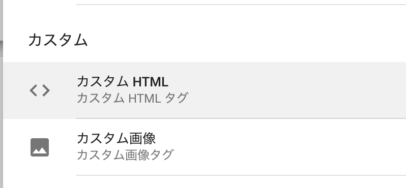
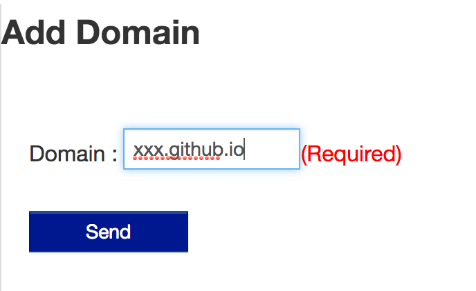
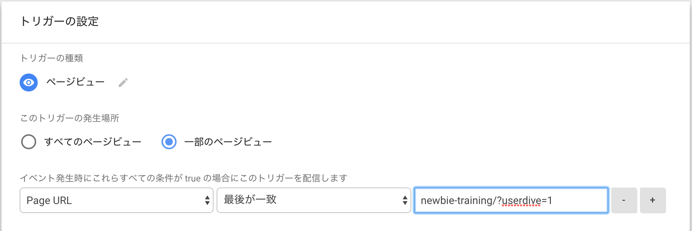

# newbie-traning

- Google Tag Manager
- Google Analytics
- USERDIVE

---

## Google Tag Manager

基本的な使い方を覚えましょう。

- タグ
- トリガー
- プレビューモード
- 変数
- ワークスペース

----

## Html Script Tag (タグ)

タグマネージャーで反映できる形(カスタムタグ)
中身は `JavaScript` というものを書きます。

```html
<script>
console.log('hello world')
</script>
```



---

## サイトを作って反映に挑戦する [(quickstart)](https://developers.google.com/tag-manager/quickstart)

1. GTMコンテナを作成する(IDを発効する)
1. サイトを立ち上げる(Githubを使う)
1. GTMのID書き換えて保存する

普段はやらないのでゆっくりやりましょう！

----

## GTMコンテナを作成する [(公式)](https://support.google.com/tagmanager/answer/6103696?hl=ja#new)

----

## サイトを立ち上げる [(forkする)](https://github.com/uncovertruth/newbie-training)


----

## サイトを立ち上げる(公開する)


----

## GTMのIDを書き換えて保存する


---

## Google Analyticsを反映する


----

## トリガーを登録する


---

## USERDIVE にドメイン登録



----

## USERDIVE を反映する [(公式)](http://docs.userdive.com/ja/web/devguide/javascript/)

```html
<!-- USERDIVE tag -->
<script>
(function(e,t,n,c,r,a,s,u){e.USERDIVEObject=r;e[r]=e[r]||function(){(e[r].queue=e[r].queue||[]).push(arguments)};
s=t.createElement(n);u=t.getElementsByTagName(n)[0];s.async=1;s.src=c;s.charset=a;u.parentNode.insertBefore(s,u)
})(window,document,"script","//harpoon3.userdive.com/static/UDTracker.js","ud","UTF-8");
ud("create", "28-105", {"env": "stg"});
ud("analyze");
</script>
<!-- End USERDIVE tag -->
```

----

## トリガーを作る（限定）

`newbie-training/?userdive=1`



---

## Google Optimize

> TODO
