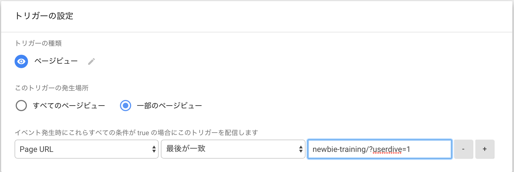

# Tutorial

* Google Tag Manager
* Google Analytics
* USERDIVE

<!--s-->

## Google Tag Manager

基本的な使い方を覚えましょう。

* タグ
* トリガー
* プレビューモード
* 変数
* ワークスペース

<!--v-->

## Html Script Tag (タグ)

タグマネージャーで反映できる形(カスタムタグ)
中身は `JavaScript` というものを書きます。

```html
<script>
console.log('hello world')
</script>
```


<!--s-->

## サイトを作って反映に挑戦する [(quickstart)](https://developers.google.com/tag-manager/quickstart)

1.  GTM コンテナを作成する(ID を発効する)
1.  サイトを立ち上げる(Github を使う)
1.  GTM の ID 書き換えて保存する

普段はやらないのでゆっくりやりましょう！

<!--v-->

## GTM コンテナを作成する [(公式)](https://support.google.com/tagmanager/answer/6103696?hl=ja#new)

<!--v-->

## サイトを立ち上げる [(fork する)](https://github.com/uncovertruth/newbie-training)


<!--v-->

## サイトを立ち上げる(公開する)


<!--v-->

## GTM の ID を書き換えて保存する


<!--s-->

## Google Analytics を反映する


<!--v-->

## トリガーを登録する


<!--s-->

## 作業を開始する

workspace を作る


<!--v-->

## USERDIVE にドメイン登録


<!--v-->

## USERDIVE を反映する [(公式)](http://docs.userdive.com/ja/web/devguide/javascript/)

```html
<!-- USERDIVE tag -->
<script>
(function(e,t,n,c,r,a,s,u){e.USERDIVEObject=r;e[r]=e[r]||function(){(e[r].queue=e[r].queue||[]).push(arguments)};
s=t.createElement(n);u=t.getElementsByTagName(n)[0];s.async=1;s.src=c;s.charset=a;u.parentNode.insertBefore(s,u)
})(window,document,"script","//harpoon3.userdive.com/static/UDTracker.js","ud","UTF-8");
ud("create", "28-105", {"env": "stg"});
ud("analyze");
</script>
<!-- End USERDIVE tag -->
```

<!--v-->

## トリガーを作る（限定）

`newbie-training/?userdive=1`



<!--v-->

## 動作確認をする

プレビューモードを使いましょう


<!--v-->

## クリックした時に

```html
<script>
if (jQuery) {
  jQuery('#about').on('click', function (e) {
    ud('setCustomVar', ['about click'])
  })
}
</script>
```
